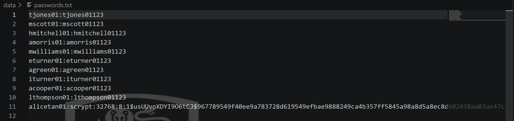
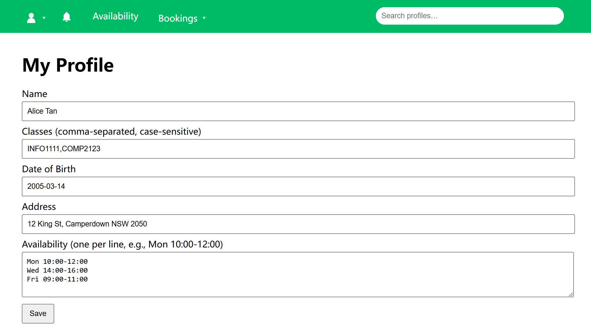
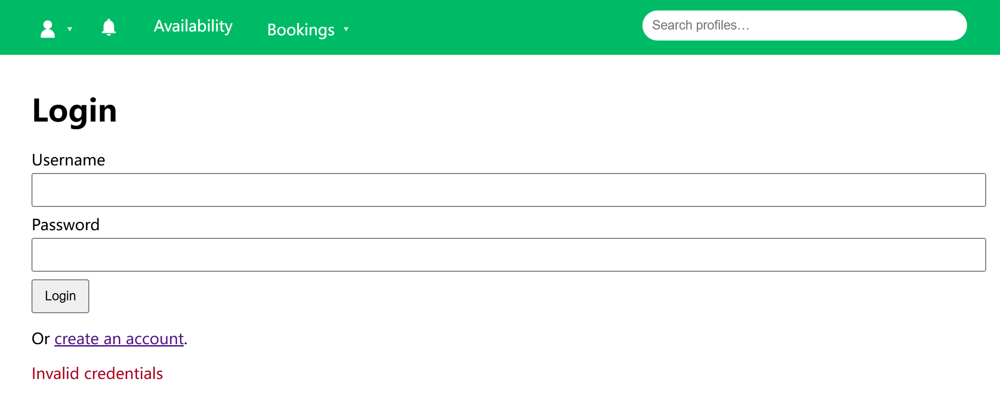

# 02 Password Hashing

## Metadata

**Environment**: Local controlled deployment of the provided Flask codebase.  
**Purpose**: To record the learning plan and evidence for replacing plaintext password storage with password hashing.

## Learning Note

**Concept learned**: A web application should not store user passwords directly. It should store a one-way password hash and verify future login attempts by checking the submitted password against that hash.

**Resource used**:

- Werkzeug security utilities documentation: `generate_password_hash()` and `check_password_hash()`.

- OWASP Password Storage Cheat Sheet: used as security context for why direct password storage is unsafe.

What I understood after reviewing the resource:

-  `generate_password_hash(password)` creates a salted password hash suitable for storage.

- In my current environment, the generated hashes use a prefix such as `scrypt:32768:8:1`, showing that Werkzeug is storing a structured password hash rather than the original password.

-  `check_password_hash(stored_hash, password)` returns whether a submitted plaintext password matches the stored hash.

- The original plaintext password should not be recoverable from the stored value.


## Baseline Observation

The original application stores passwords directly in `data/passwords.txt`.

Relevant baseline code:

```python
def set_pwd(username, password):
  with open(PASSWORDS_FILE, 'a', encoding='utf-8') as fh:
    fh.write(f"{username}:{password}\n")
```
The original login route also compares the submitted password directly with the stored string:
```python
if username in pw_map and pw_map[username] == password:
  session['username'] = username
```
Baseline behaviour observed from the previous review:
```text
plaintext_password_file: OBSERVED
plaintext_login_succeeds: OBSERVED
```

## Planned Code Change

This step will only change password storage and login verification:

1. Use `generate_password_hash()` when saving a password.

2. Use `check_password_hash()` when verifying login.

3. Keep the rest of the authentication and authorisation behaviour unchanged for later learning cycles. 

## Test Plan

After the code change, I will test:

| ID | Test | Expected result |
| -- | ---- | --------------- |
| PH1 | Create a new user and inspect `data/passwords.txt`. | The stored value is a Werkzeug hash, not the original password. |
| PH2 | Log in with the correct password for that user. | Login still succeeds. |
| PH3 | Log in with an incorrect password for that user. | Login fails, and no session is created. |

## Test Evidence

**Screenshot folder**: `evidence/password_hashing/`

### PH1: Stored Password Is Hashed

**Result**: Pass

**Explanation**: After signing up as the test user **alicetan01**, the stored password is no longer directly readable in `data/passwords.txt`.



### PH2: Correct Password Still Logs In

**Result**: Pass

**Explanation**: Password hashing should not prevent a legitimate user from logging in with the correct password. Here we logged in using the correct password and successfully loaded the profile page.



### PH3: Wrong Password Is Rejected

**Result**: Pass

**Explanation**: A submitted password that does not match the stored hash should be rejected. Here, we used the incorrect password for the test user, and the login was rejected.




## Reflection Placeholder

Reflection will be completed after implementation and testing.